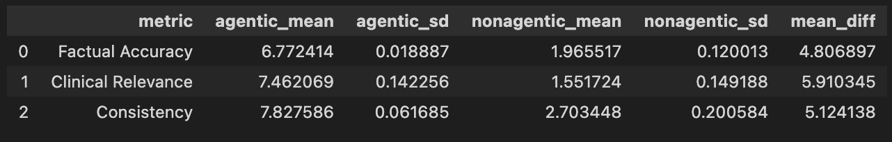

# MedAgent

An agentic framework which uses reports from a patients medical history and compiles them into a summary report with actionable insights. Further, a chatbot for a doctor to use which has generated report as context.

The reports generated are evaluated with an LLM-as-a-Judge on some pre0defined criteria.

- Download the dependencies in ```requirements.txt```
- To run the application, execute the following command
```chainlit run main.py```
- To generate more testcases, execute the notebook ```testcase_gen.ipynb```
- To generate agentic and non-agentic summaries for patients, run the script ```summary_gen.py```
- To evaluate summary reports with the LLM-as-a-Judge system, run the script ```evaluator.py```

Our results on 30 sample patients (with 5 iterations over all samples), comparing the agentic framework's report vs the non-agentic framework's report.


